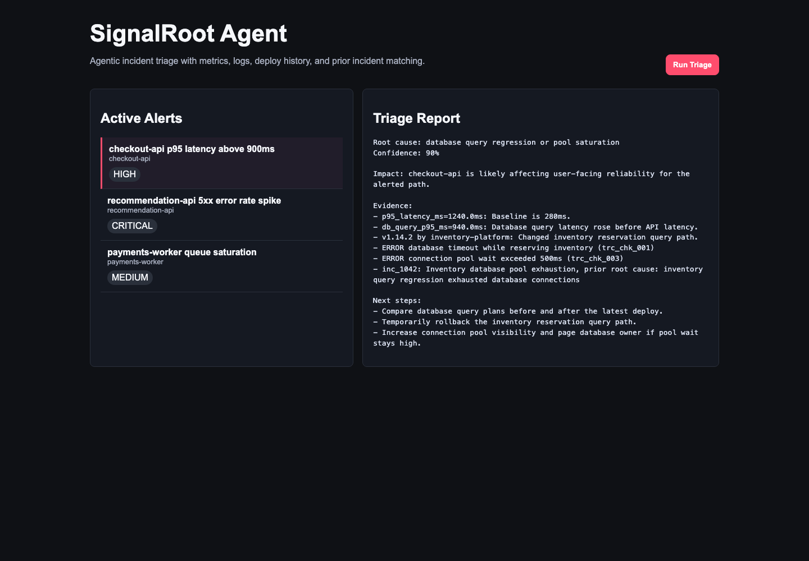

# SignalRoot Agent

[](https://github.com/sunnnn2005/signalroot-agent/actions/workflows/test.yml)
[](LICENSE)

SignalRoot Agent is an incident-triage assistant for platform and reliability teams. It correlates alerts, metrics, logs, deploy history, and prior incidents to produce a root-cause hypothesis with supporting evidence and recommended next steps.



## Highlights

- Deterministic agent workflow with explicit tool calls and trace output
- FastAPI backend with documented JSON contracts
- Built-in web dashboard for live demos
- Realistic incident scenarios for checkout, recommendations, and payments systems
- Test suite covering agent behavior, API routes, and dashboard rendering
- Dockerfile and GitHub Actions workflow for repeatable delivery

## Tech Stack

- Python 3.11+
- FastAPI
- Pydantic
- Pytest
- Vanilla HTML/CSS/JavaScript dashboard

## Quick Start

```bash
python -m venv .venv
source .venv/bin/activate
pip install -r requirements.txt -r requirements-dev.txt
uvicorn app.main:app --reload
```

Open:

- API docs: `http://127.0.0.1:8000/docs`
- Dashboard: `http://127.0.0.1:8000/dashboard`

## Run Tests

```bash
python -m pytest
```

## Docker

```bash
docker build -t signalroot-agent .
docker run --rm -p 8000:8000 signalroot-agent
```

## Example API Call

```bash
curl -X POST http://127.0.0.1:8000/alerts/alert_checkout_latency/triage
```

## Project Structure

```text
app/
  agent.py       Agent orchestration and root-cause ranking
  data.py        Deterministic demo alerts, metrics, logs, deploys, incidents
  dashboard.py   Built-in demo UI
  main.py        FastAPI routes
  models.py      API and agent data models
  tools.py       Tool abstractions used by the agent
docs/
  architecture.md
  spec.md
tests/
  test_agent.py
  test_api.py
```

## Resume Summary

Built an agentic incident-triage platform that correlates service alerts with metrics, logs, deploy history, and known incident signatures to generate ranked root-cause hypotheses, blast-radius analysis, and actionable remediation steps through a FastAPI API and interactive dashboard.
